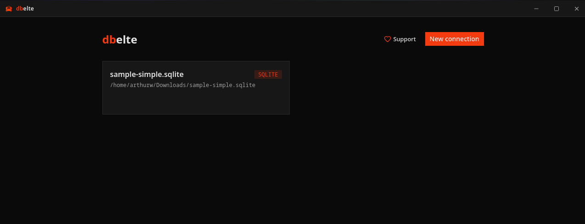
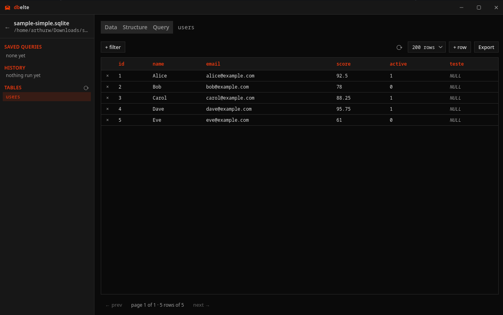
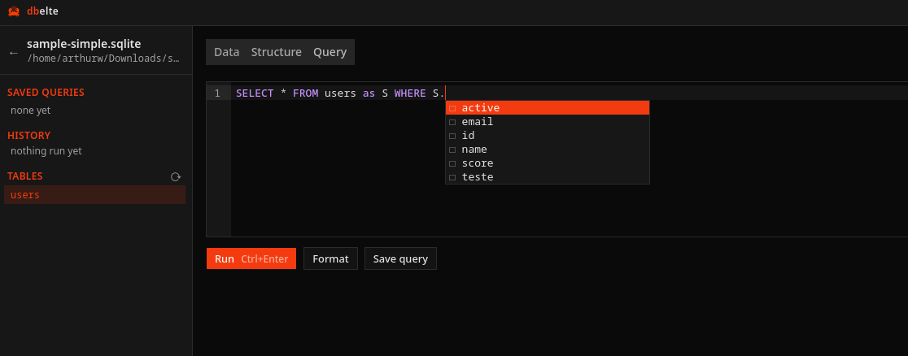

<div align="center">


# dbelte

**A lightweight desktop database manager for PostgreSQL and SQLite.**

Browse and edit table data, run and save SQL, export results — in a minimal orange-on-black UI that starts instantly and stays out of your way.

[](../../releases/latest)
[](https://ko-fi.com/arthurwieb)

</div>

---

## Screenshots

<div align="center">



*Your saved databases. Click a card to open it.*



*Browse and filter rows, sort by any column, double-click a cell to edit it.*



*Write SQL with autocomplete that knows your tables and columns. `Ctrl+Enter` runs it.*

</div>

## What it does

- **Browse tables** — paginated rows, click a header to sort, stackable filters (`contains`, `starts with`, `IN`, `LIKE`, …).
- **Edit safely** — double-click a cell, confirm the change in a dialog that shows old value, new value, and which row it hits.
- **Run SQL** — CodeMirror editor with schema-aware autocomplete, one-key formatting, saved queries, and a per-connection history of the last 50 statements.
- **Follow foreign keys** — a **↗** next to a value jumps to the table it points at, filtered to that row.
- **Export** — CSV or JSON, filters and sort included, the whole result rather than the page on screen.
- **Big values, readable** — JSON and long text open in a syntax-coloured dialog instead of a cramped inline box.
- **Native and small** — a ~10 MB binary, not a 400 MB Electron install.
- **Passwords stay in your OS keyring** — Keychain, Credential Manager, or your Linux keyring. Never in a file belonging to dbelte.

## Install

You don't need Rust, bun, or anything else to *use* dbelte — those are only for
building it yourself. Grab the file for your system from the
[Releases page](../../releases/latest) and run it.

### Windows

1. Download the file ending in **`.msi`** (for example `dbelte_0.1.3_x64_en-US.msi`).
2. Double-click it.
3. Windows will likely show a blue box: **"Windows protected your PC"**.
   This does *not* mean the file is broken or dangerous — it means the app
   isn't signed with a paid Microsoft certificate, which every small project
   starts out without. Click **More info**, then **Run anyway**.
4. Follow the installer. dbelte then appears in your Start menu.

If `.msi` gives you trouble, the `.exe` in the same list is an alternative
installer that does the same job.

### macOS

1. Download the file ending in **`.dmg`** (for example `dbelte_0.1.3_universal.dmg`).
   The `universal` build works on both Apple Silicon (M1/M2/M3/M4) and older
   Intel Macs, so there's only one to choose from.
2. Double-click it, then drag the **dbelte** icon onto the **Applications**
   folder shown next to it.
3. Open **Applications** and try to launch dbelte. macOS will refuse the first
   time, saying the app is **damaged** or from an **unidentified developer**.
   It isn't damaged — that's macOS's wording for "not signed with a paid Apple
   certificate."
4. To get past it: **right-click** (or Control-click) the dbelte icon and
   choose **Open**, then click **Open** in the dialog. You only do this once;
   afterwards it launches normally.

If right-click → Open still refuses, open the **Terminal** app and run:

```sh
xattr -cr /Applications/dbelte.app
```

That clears the "downloaded from the internet" flag. Then launch it normally.

### Linux

Three formats — pick the one for your distribution:

**AppImage** (works on any distro, no installation, good if you're unsure):

```sh
chmod +x dbelte_0.1.3_amd64.AppImage   # make it runnable, once
./dbelte_0.1.3_amd64.AppImage          # run it
```

**Debian / Ubuntu / Linux Mint / Pop!_OS** — download the `.deb` and:

```sh
sudo apt install ./dbelte_0.1.3_amd64.deb
```

**Fedora / RHEL / openSUSE** — download the `.rpm` and:

```sh
sudo dnf install ./dbelte-0.1.3-1.x86_64.rpm
```

With `.deb` or `.rpm`, dbelte shows up in your applications menu like any
other program. Replace the version numbers above with whatever the files are
actually called.

## First run

Open dbelte and click **New connection**.

- **SQLite** — pick **SQLite** as the engine and click **Browse** to find your
  `.db` file. Nothing else to fill in.
- **PostgreSQL** — if you have a connection URL (it starts with
  `postgres://`), paste it into the top field and the rest of the form fills
  itself in. Otherwise type the host, port, database, username and password by
  hand.

Click **Test** to check it works, then **Save**. Your new connection appears as
a card — click it to start browsing.

Passwords are stored in your operating system's own password manager
(Keychain, Credential Manager, or your Linux keyring), not in a file
belonging to dbelte.

## Using dbelte

### Connections

A connection is a saved database — name, engine, and how to reach it. PostgreSQL takes host/port/database/user; SQLite takes a file path (use **Browse**, or type an absolute path — a relative one resolves against the app's working directory, not yours).

Clicking a connection card opens a **workspace**.

### The workspace

A sidebar of saved queries, recently run statements, and tables, and three tabs for whatever table you've selected. Drag the sidebar's right edge to resize it; the width is remembered. Past ten tables a filter box appears above the list.

On PostgreSQL the list covers every schema you own, not just `public`. Tables outside `public` are shown as `schema.table`, and everything downstream — filters, edits, exports, foreign-key jumps — is qualified with the schema, so two tables with the same name in different schemas stay distinct.

### Data tab

The rows, paginated. **⟳** re-reads the current page. Sort by clicking a column header. Double-click a cell to edit it, then confirm the change in a dialog that shows the old and new value and which row it lands on. The row limit (50–1000) is a dropdown in the toolbar, because "SELECT everything" is how you hang a client on a big table. The pager counts the filtered set, so it reads "page 2 of 14 · 200 rows of 2731".

A cell whose value is JSON, or longer than a line, opens in a dialog instead of an inline box — double-click it, or pick **Expand** from the right-click menu. JSON gets re-indented and syntax-coloured; anything else gets a plain textarea. `Ctrl+Enter` saves, and read-only cells (primary keys, tables without one) open in the same dialog to be read.

A value that's a foreign key gets a **↗** next to it. Click it to jump to the table it points at, filtered to that row. Composite foreign keys are skipped — a single equality filter can't express them.

Filters stack with AND and cover more than equality: `contains` / `starts with` / `ends with` build the LIKE pattern for you and escape any `%` or `_` you typed literally, while raw `LIKE` / `ILIKE` leave your wildcards alone. `IN` takes a comma-separated list. **`ILIKE` is PostgreSQL-only** — on SQLite it degrades to `LIKE`, which is already case-insensitive there for ASCII.

### Structure tab

The column list, and adding a column. The type field is a searchable dropdown of that engine's real types (SQLite gets its five storage classes, not Postgres's fifty); anything you type that isn't in the list is offered verbatim, so `numeric(12,4)` and `text[]` both work.

### Query tab

A CodeMirror editor with autocomplete that knows your actual tables and columns. `Ctrl+Enter` (`⌘↵` on a Mac) runs. Save a query and it lands in the sidebar.

Everything you run is logged to **History** in the sidebar — the last 50 statements per connection, newest first, click one to load it back into the editor. Re-running the same statement doesn't stack up duplicates. **clear** empties it.

**Format** (or `Shift+Alt+F`, `⇧⌥F` on a Mac) pretty-prints the buffer using the right dialect for the connection. Unparseable SQL is left alone rather than mangled.

While a query runs, **Run** becomes **Cancel**. On PostgreSQL that cancels the statement on the server itself, not just in the app.

### Right-click menus

Most of the app has a context menu, because the useful actions are the ones you'd otherwise write out by hand:

- **A table in the sidebar** — drop `SELECT * FROM …` or `SELECT count(*) FROM …` into the Query tab ready to run, jump to its structure, or copy the name.
- **A cell in the grid** — copy the value, copy the whole row as JSON, copy the column name, follow a foreign key; and on editable tables, edit the cell, set it to `NULL`, or delete the row.
- **The SQL editor** — run, format, select all, copy, save, clear.

### Export

CSV or JSON, from either the Data tab or a query result. Export re-runs the query rather than dumping what's on screen, so you get the whole result and not just the current page. Data-tab export applies the active filters and sort — what you filtered to is what you get, minus the page limit.

### Editing requires a primary key

To update or delete a row, the app has to be able to name that row unambiguously. It uses the primary key — composite keys included, matched on every column at once. A table with no primary key is read-only: the UI hides the controls and the backend refuses anyway. Partial keys are refused too, since half a composite key matches many rows. This is a deliberate limit, not a missing feature: guessing at row identity is how a data manager corrupts data.

## Current limitations

Deliberate cuts, roughly in order of how likely you are to hit them:

- Filter values bind by declared column type — exotic types (arrays, enums, ranges) fall back to text comparison.
- `sslmode` / `channel_binding` URL params are ignored (sqlx defaults to TLS-preferred, which Neon accepts).
- Connecting gives up after 10 seconds; there's no way to change that.
- Row counts are exact, so `count(*)` on a huge unfiltered table costs what it costs.
- `add_column` whitelists type strings to alphanumerics plus `(),_[] `, so anything more exotic than an array type has to go through the Query tab.
- Tables with no primary key at all are still read-only.
- Query history is per connection and capped at 50 statements; it isn't searchable.

## License

MIT — see [LICENSE](LICENSE).

## Support

dbelte is free and always will be. If it saved you from another Electron install, you can [buy me a coffee on Ko-fi](https://ko-fi.com/arthurwieb).

---

# For developers

Everything below is about building and changing dbelte, not using it.

## Why it's built this way

Most database GUIs are either a browser tab pretending to be an app, or a 400 MB Electron install that takes ten seconds to show you a table. dbelte is a ~10 MB native binary that opens a connection and shows you rows.

The design has three rules:

**The webview never touches your database.** Every query runs in Rust. The frontend calls `invoke()` and gets JSON back. Connection strings, passwords, and driver handles never exist in JavaScript.

**Your passwords aren't ours to keep.** Credentials go into the OS keyring — Secret Service on Linux, Keychain on macOS, Credential Manager on Windows. The app's own metadata store holds everything *except* the password.

**Dynamic SQL is a boundary, not a convenience.** Filters, sorts, and pagination build real SQL, so that builder is the one piece of the codebase treated as hostile territory: every identifier is validated against the live table schema before it's quoted, and every value is a bound parameter. It has unit tests, and they're the tests that matter most.

## Stack

| Layer | Tech |
|-------|------|
| Desktop shell | Tauri 2 (custom title bar, no native decorations) |
| Frontend | SvelteKit (Svelte 5 runes, `adapter-static`, SSR off), TypeScript |
| Styling | Tailwind CSS v4 + shadcn-svelte (dark-only, square corners, Svelte orange `#ff3e00`) |
| Editors | CodeMirror 6 + `@codemirror/lang-sql` (schema-aware autocomplete) and `@codemirror/lang-json` (expanded cells) |
| DB access | Rust: `sqlx` (postgres + sqlite, rustls) |
| Secrets | OS keyring (`keyring` crate) |
| App metadata | SQLite file in Tauri's app-data dir (`meta.db`) |
| Package manager | **bun** (never npm) |

## Development

Prerequisites: [bun](https://bun.sh), [Rust](https://rustup.rs) (stable), and the platform webview toolchain.

Linux (Fedora):

```sh
sudo dnf install webkit2gtk4.1-devel gtk3-devel dbus-devel librsvg2-devel openssl-devel libappindicator-gtk3-devel patchelf
```

Linux (Debian/Ubuntu):

```sh
sudo apt install libwebkit2gtk-4.1-dev libgtk-3-dev libappindicator3-dev librsvg2-dev libssl-dev build-essential curl wget file
```

macOS needs Xcode Command Line Tools; Windows needs the MSVC build tools and WebView2 (preinstalled on Windows 11).

Then:

```sh
bun install
bun run tauri dev      # launches the desktop app with HMR
```

First run compiles the whole Rust dependency tree — expect a few minutes; later runs are incremental.

> `bun run dev` alone only serves the frontend in a browser. Every database call goes through Tauri `invoke()`, so nothing works outside the desktop window. Use it only for pure UI/CSS work.

Other useful commands:

```sh
bun run check                      # svelte-check (TS errors)
bun run build                      # frontend production build only (outputs to build/)
cd src-tauri && cargo test --lib   # query-builder unit tests
cd src-tauri && cargo check        # also validates capability permissions
```

A sample database (`sample.db`, tables `users` + `orders`) sits in the repo root for testing.

Replacing the logo: drop a square transparent PNG at `static/logo.png`, then `bunx tauri icon static/logo.png` to regenerate every platform icon.

Screenshots in this README live in `docs/screenshots/` (`connections.png`, `data.png`, `query.png`). Retake them against `sample.db` at a 1280×800 window so they stay consistent.

## Building an executable

```sh
bun run tauri build
```

Runs `bun run build`, compiles Rust in release mode, then packages installers. First release build is slow (5–15 min).

| What | Where |
|------|-------|
| Raw binary | `src-tauri/target/release/dbelte` (`.exe` on Windows) |
| Installers/bundles | `src-tauri/target/release/bundle/` |

`tauri.conf.json` sets `"targets": "all"`, so each platform builds everything it can:

- **Linux** — `bundle/deb/`, `bundle/rpm/`, `bundle/appimage/`. The AppImage is the portable one: `chmod +x` and run.
- **macOS** — `bundle/macos/dbelte.app` and `bundle/dmg/`. Unsigned builds get Gatekeeper-blocked elsewhere; needs an Apple Developer ID to sign and notarize.
- **Windows** — `bundle/nsis/` and `bundle/msi/`.

Single target instead of all:

```sh
bun run tauri build --bundles appimage    # or deb, rpm, dmg, nsis, msi
bun run tauri build --no-bundle           # binary only, skip packaging
```

### Building the AppImage on Fedora

Two things bite, and both surface as the same unhelpful message —
`failed to bundle project: failed to run linuxdeploy` — after the Rust build
has already succeeded:

1. **`patchelf` must be installed** (it's in the prerequisites above). linuxdeploy
   uses it to rewrite rpaths.
2. **Set `NO_STRIP=true`.** linuxdeploy runs `strip` over every bundled library,
   and Fedora's binutils rejects some of what the GTK plugin pulls in, which
   linuxdeploy treats as fatal.

```sh
NO_STRIP=true bun run tauri build --bundles appimage
```

The unstripped result is around 110 MB, against ~9 MB for the `.rpm` — the
AppImage carries its own copy of GTK and WebKit, which is the whole point of the
format. CI builds on Ubuntu, where stripping works, so the released AppImage is
smaller than a local Fedora one.

A locally built AppImage also carries the bundled `libwayland-*` that the release
workflow strips out (see below) — if it aborts with
`Could not create default EGL display: EGL_BAD_PARAMETER`, that's why. Delete
those libraries from the AppDir and repack, or just test with the `.rpm`.

Cross-compiling is not supported — build each OS on that OS (or in CI).

### Releasing

`.github/workflows/release.yml` builds macOS (universal), Linux and Windows in
parallel and attaches the installers to a **draft** GitHub release. Draft
releases are visible only to you until you publish them.

```sh
# 1. bump the version in all three manifests (they must agree)
#    package.json · src-tauri/tauri.conf.json · src-tauri/Cargo.toml
# 2. tag and push
git tag v0.2.0
git push origin v0.2.0
# 3. review the draft release on GitHub, then publish
```

`tauri-action` reads the version from `tauri.conf.json`, so a tag that disagrees
with it produces confusingly-named artifacts.

After the Linux build, the workflow unpacks the AppImage, deletes the bundled
`libwayland-*`, and repacks it. linuxdeploy bundles Ubuntu's copies, which shadow
the host's newer ones on distros like Fedora and make Mesa reject the EGL display
(`EGL_BAD_PARAMETER`) — WebKit then aborts before the window appears.

macOS artifacts are unsigned — other people will hit a Gatekeeper warning until
the workflow is given an Apple Developer ID (`APPLE_CERTIFICATE`,
`APPLE_SIGNING_IDENTITY`, `APPLE_ID`, `APPLE_PASSWORD` secrets). The `.rpm` is
unsigned too; signing it only pays off alongside a real dnf repo.

## Architecture

All database work happens in Rust; the webview only calls `invoke()`. Credentials never enter the frontend.

```
src/                            SvelteKit frontend
  lib/api.ts                    typed invoke() wrappers — the full command surface
  lib/confirm.svelte.ts         promise-based confirm() backed by a themed modal
  lib/links.ts                  external URLs (Ko-fi)
  lib/cm.ts                     CodeMirror theme + highlight style, shared by both editors
  lib/components/
    Grid.svelte                 shared data grid (sort, dbl-click edit, expand dialog, row delete)
    DataTab.svelte              filters, row limit, pagination, insert/edit/delete, export
    StructureTab.svelte         column list + ALTER TABLE ADD COLUMN (searchable type picker)
    QueryTab.svelte             CodeMirror editor, run/save/export
    SqlEditor.svelte            CodeMirror 6 setup, schema autocomplete, SQL formatting
    JsonEditor.svelte           CodeMirror 6 for the expanded-cell dialog (JSON, read-only mode)
    TitleBar.svelte             custom window chrome (decorations are off)
    ResizeGrips.svelte          edge/corner resize handles an undecorated window loses
    ConfirmDialog.svelte        the single mounted confirm modal
    Spinner.svelte              the one loading indicator
    ui/                         shadcn-svelte components (copied in, editable)
  routes/
    +layout.svelte              title bar + confirm modal + toaster shell
    +page.svelte                connection cards + add/edit dialog (URL paste autofill)
    c/[id]/+page.svelte         workspace: resizable sidebar + tabs
    layout.css                  the entire theme (shadcn CSS variables, dark-only)

src-tauri/src/                  Rust backend
  lib.rs                        Tauri builder, state, command registration
  meta.rs                       app metadata store (connections, saved queries) + keyring
  db.rs                         Pool enum (Pg|Sqlite), row→JSON decoding,
                                SELECT builder (THE injection boundary — unit tested)
  commands.rs                   all #[tauri::command] handlers
```

Key invariants:

- **Identifiers are never interpolated raw.** Filter/sort columns are validated against the live table schema; identifiers go through `quote_ident`; values are always bound parameters. `db.rs` unit tests cover this — keep them green.
- **Editing requires exactly one PK column.** Tables without a single-column primary key are read-only in the UI (backend enforces too).
- **Pools are held behind an `Arc`, not the map lock.** `with_pool!` clones the `Arc` and releases `AppState.pools` immediately — holding that lock for a query's duration would serialise every command in the app, and would deadlock cancellation against the query it's trying to cancel.
- **Query cancellation on PostgreSQL is real.** The app opens a second session and calls `pg_cancel_backend` on the exact backend running your statement. SQLite has no server to ask, so cancelling frees the tab and discards the connection.
- **Passwords live only in the OS keyring** (service `"dbelte"`, key = connection UUID). `meta.db` holds everything else.
- **Window controls need explicit capabilities.** `core:window:default` is read-only; minimize/close/toggle-maximize/dragging are granted one by one in `src-tauri/capabilities/`. A missing one fails silently at runtime — `cargo check` validates the identifiers.
- `WEBKIT_DISABLE_DMABUF_RENDERER=1` is set on Linux in `lib.rs` — WebKitGTK's DMA-BUF renderer segfaults on some GPU stacks (AMD/Wayland included). Don't remove it.
- keyring uses the `sync-secret-service` feature on Linux. The async zbus backend panics inside Tauri's tokio runtime ("cannot start a runtime from within a runtime").

## Adding a database engine

The architecture is shaped for this: `DbPool` is an enum, so adding an arm makes the compiler list every place that needs a decision.

**MySQL/MariaDB** is roughly half a day — sqlx has a native driver, so the whole query/bind/execute path generalizes. New enum arm, an `open` branch, a `mysql_value` decoder mirroring `pg_value`, and two `information_schema` introspection queries. The one careful bit is `quote_ident`, which hardcodes `"` and would need backticks. Worth converting `build_select`'s `is_pg: bool` into a `Dialect` enum first — it already carries two meanings (placeholder style *and* ILIKE support).

**Anything sqlx doesn't ship** (MSSQL, Oracle, DuckDB) is days, not hours: different driver APIs mean `execute` no longer generalizes, and dialects diverge further (`OFFSET…FETCH`, `[brackets]`, `@p1`).

**MongoDB and friends** don't fit at all — `build_select`, `ColumnInfo`, and "exactly one PK column" have no analogue. That would be a separate view, not a `DbPool` arm.

## Gotchas learned the hard way

- `shadcn-svelte init` is interactive and fights automation — `components.json` was written by hand; `shadcn-svelte add -y <components>` works fine after that. `add -o` will overwrite existing components, so back up `src/lib/components/ui/` first.
- Svelte 5: don't read reactive state inside the `$effect` that creates CodeMirror — every keystroke recreates the editor and drops focus. It's created once in `onMount` with `untrack`.
- Tauri v2 auto-converts command arg names: Rust `snake_case` ⇄ JS `camelCase`. `default` is a Rust keyword — the add-column arg is `default_value`.
- `sqlx` with `default-features = false` needs the `macros` feature for `#[derive(FromRow)]`.
- An undecorated window loses the WM's resize border — hence `ResizeGrips.svelte`. Without it the window is stuck at its initial size on Linux.
- External links must go through `@tauri-apps/plugin-opener`; a plain `<a href>` navigates the webview away from the app.
- The crate is named `dbelte`, not the template's `app` — that name becomes the Linux binary, `Exec=`, `StartupWMClass`, and the icon filenames.
